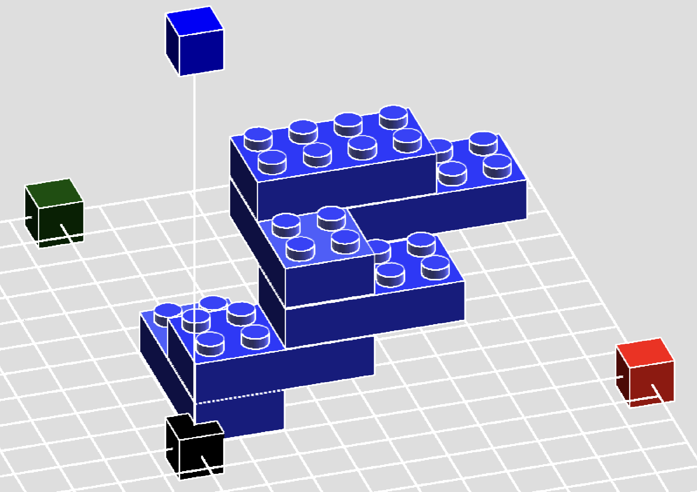
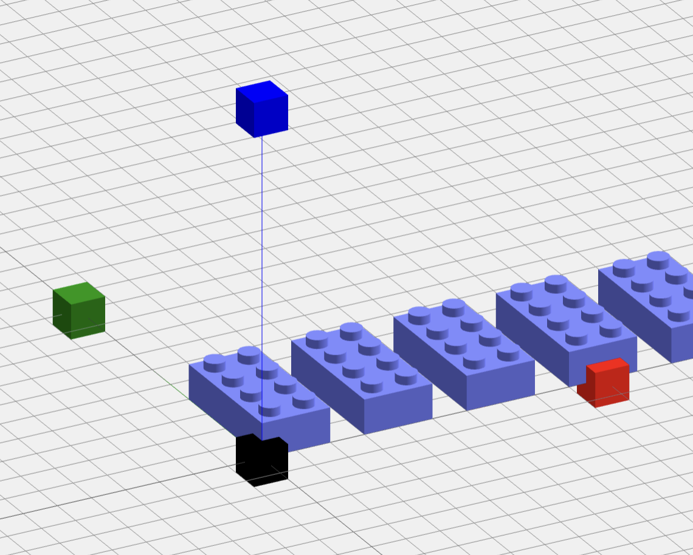

# Lego render Three.JS

- Render a bunch of Lego bricks using Orthographic Camera. 
- Rewritten camera orbit to allow intuitive panning and orbiting in the world space.
- Render outline using technique by [OmarShehata](https://github.com/OmarShehata/webgl-outlines/tree/4d94f360e083540c8bb860bed3509c0d4528d22c)

